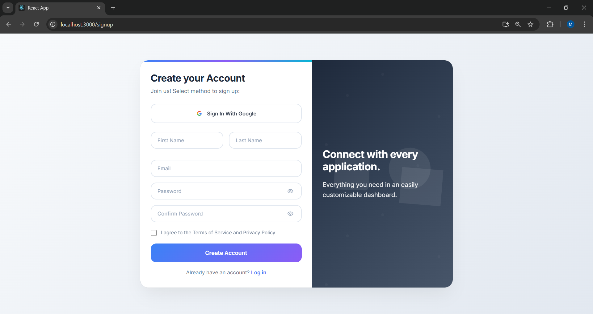
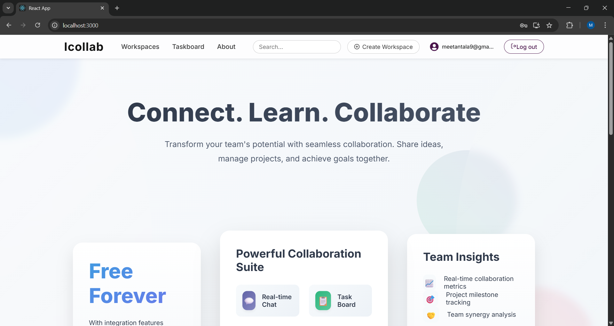
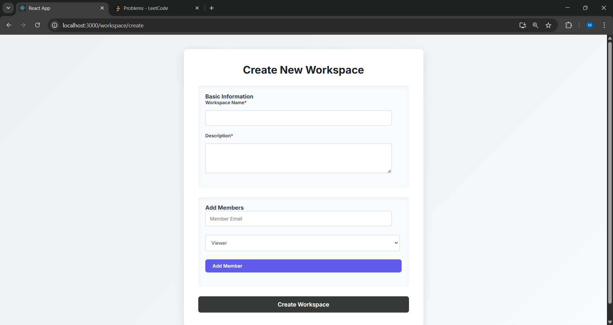
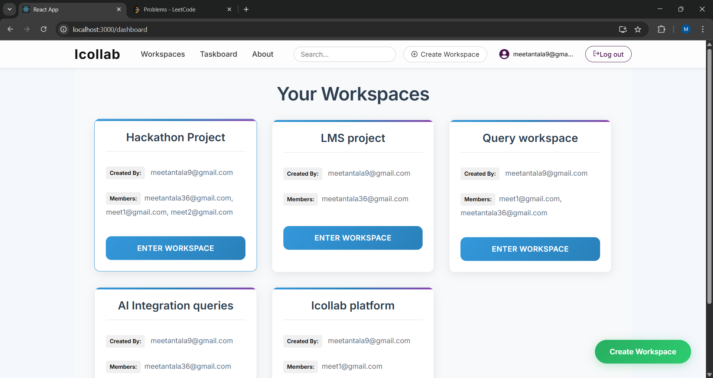
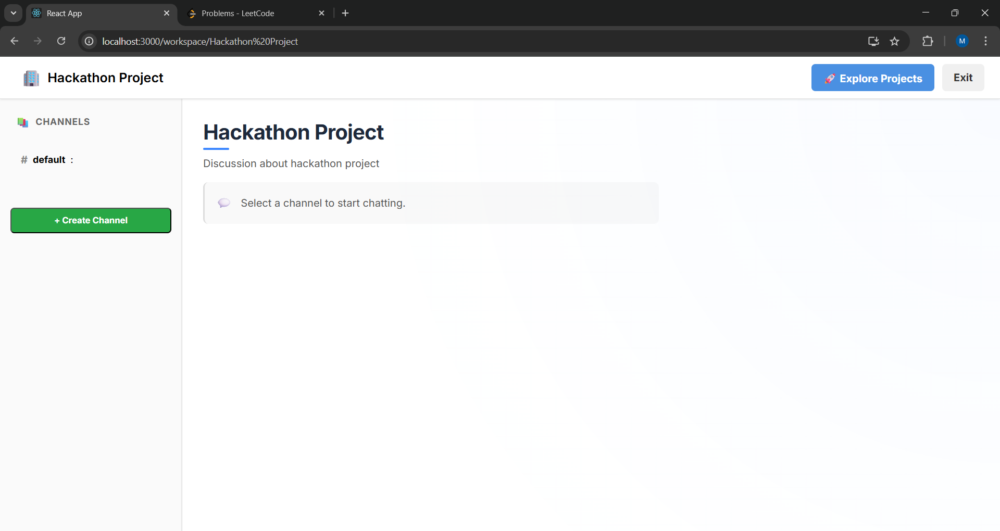
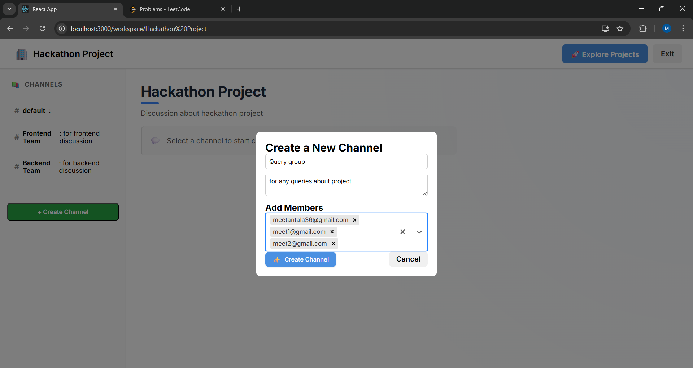
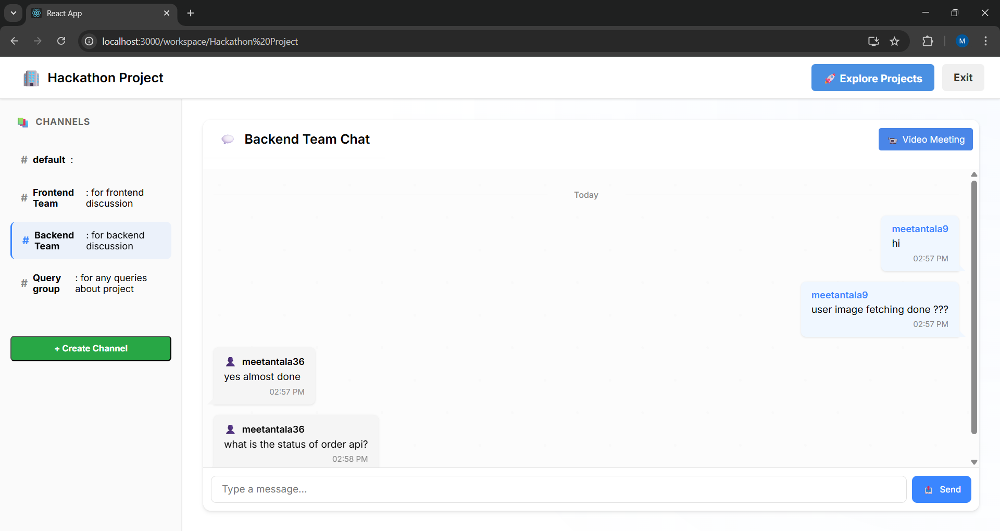
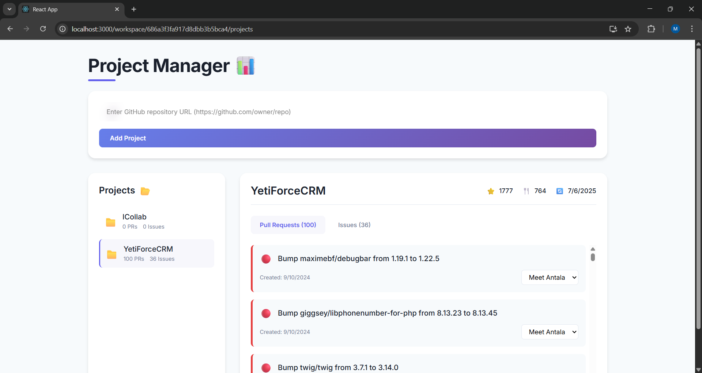
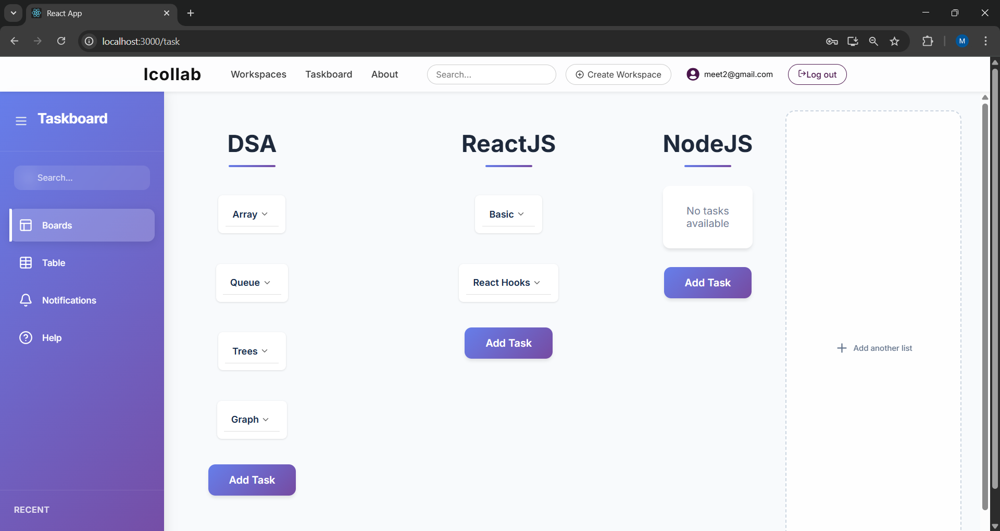
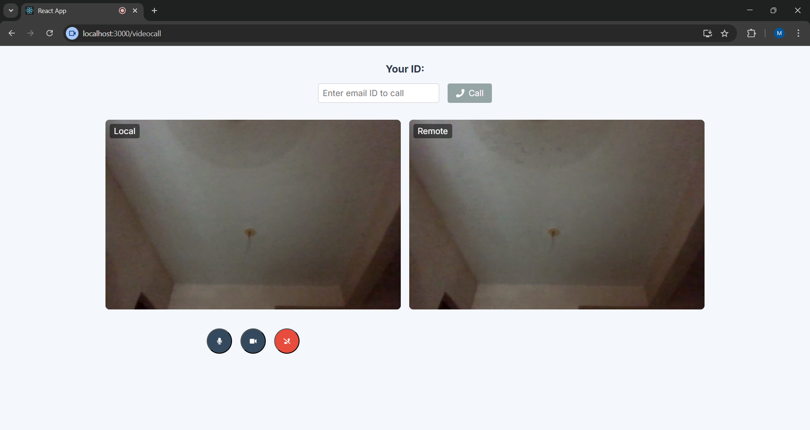

# 🤝 Icollab - Collaborative Tool

**Icollab** is a full-featured MERN stack web application designed to streamline team communication, enhance productivity, and simplify project coordination. It provides a centralized platform for messaging, task management, and video conferencing.

## 🚀 Features

- 🔐 Authentication using JWT + Google OAuth
- 💬 Real-time messaging with Socket.IO
- 🎥 Video calling & screen sharing with WebRTC
- 🗂️ Multi-workspace and multi-channel structure
- 🔄 Persistent login using localStorage

## 🛠️ Tech Stack

- **React.js**
- **Node.js**
- **Express.js**
- **MongoDB Atlas**
- **JWT (JSON Web Tokens)** – User authentication
- **bcrypt** – Password hashing
- **Socket.IO** – Real-time chat
- **WebRTC** – Video calling

## 📸 Screenshots

Here are some screenshots demonstrating the core functionalities:

